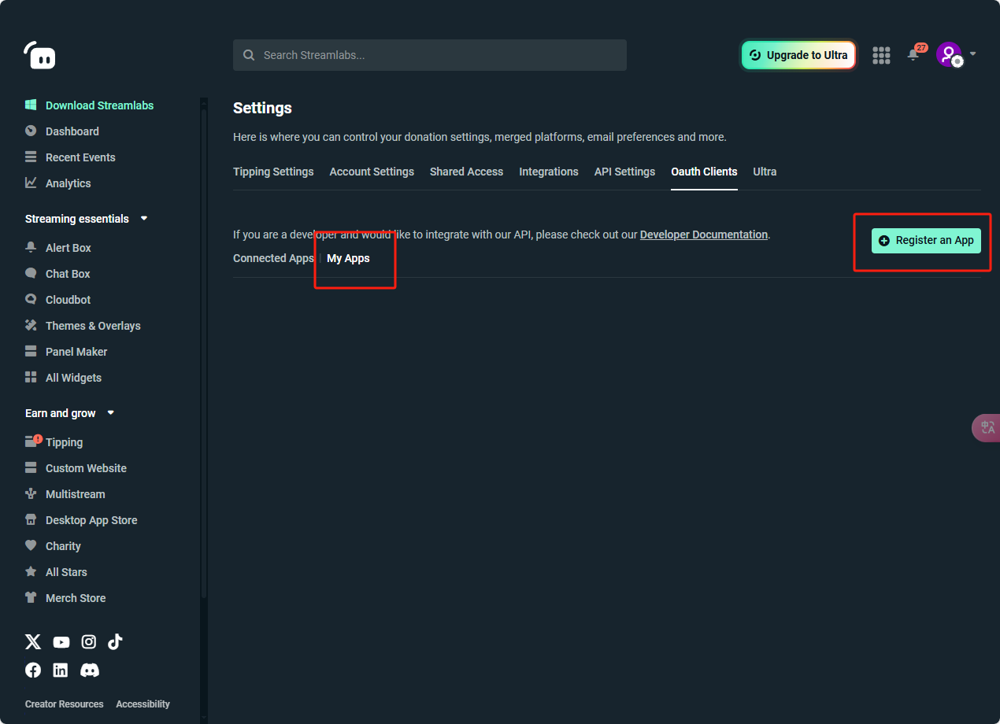
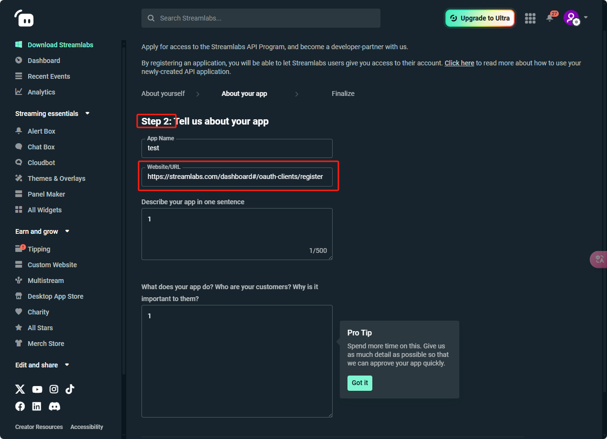
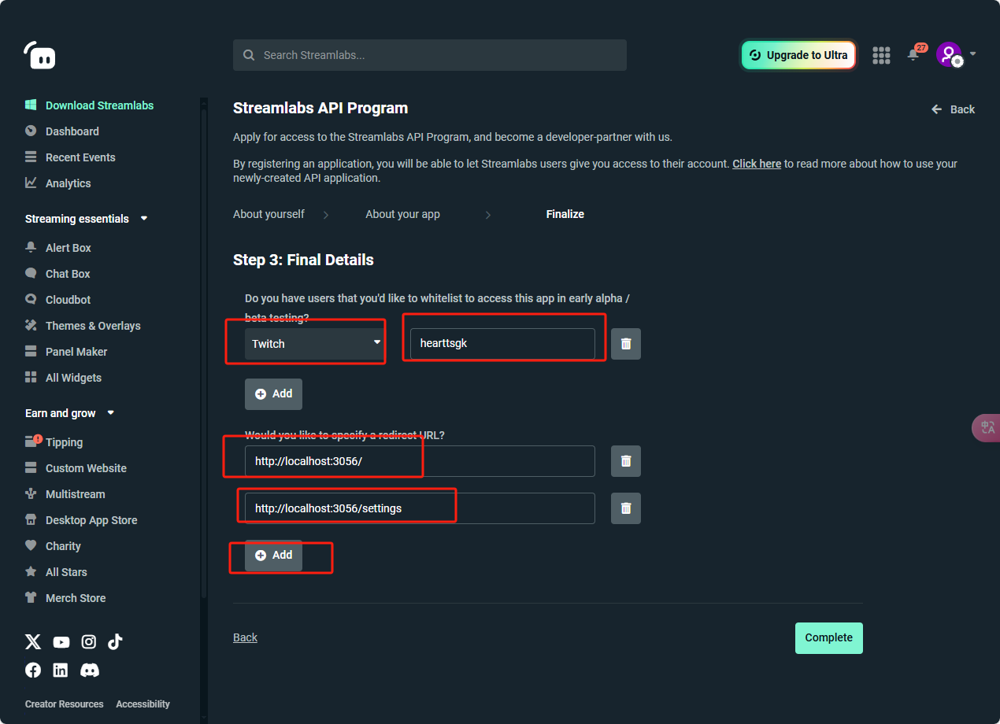
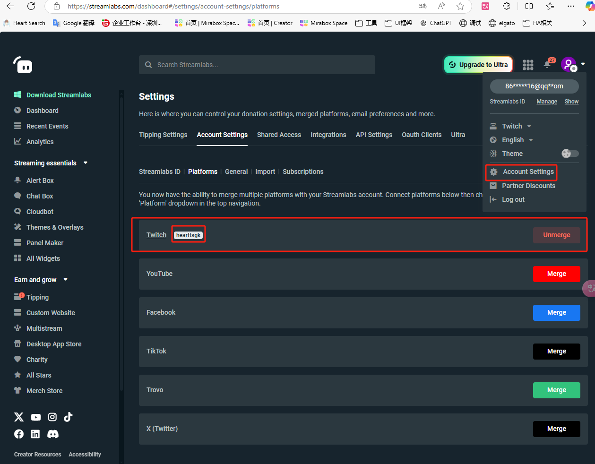
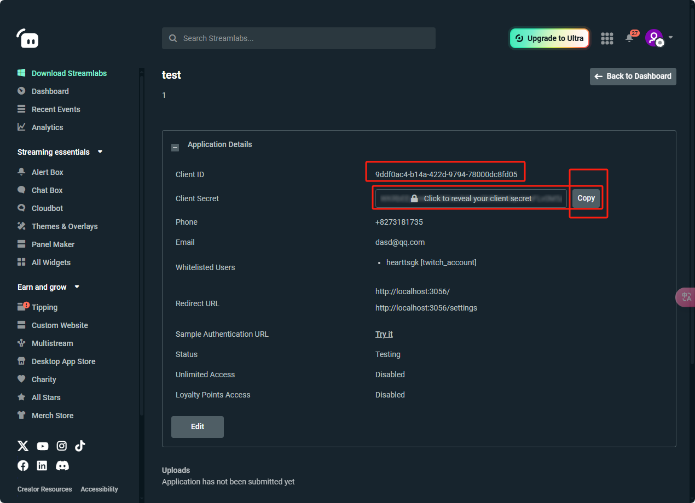

## 1. Create an app

## 2. Fill in the first step randomly, and copy any URL from this URL in the second step.

## 3. The whitelist must contain the username of the account you subsequently authorize. This is related to whether the authorization is successful. It needs to be combined with the username of the account on other platforms. The redirect URL must be these two: `http://localhost:3056/` and `http://localhost:3056/settings`

You can find the usernames that need to be added to the whitelist here. If they are not merged with any platform, you need to merge them

## 4. After completion, you can obtain the Client Secret and Client ID for authorization

